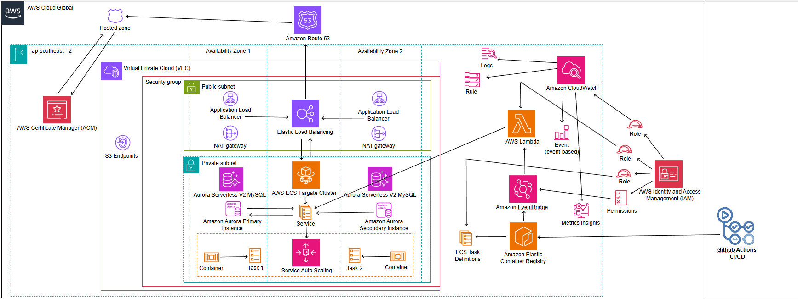

# CloudStruct: Serverless Backend with AWS Fargate, Aurora and Event-Driven Lambda CI/CD Automation

This repository contains Terraform Infrastructure as Code (IaC) for a production-grade serverless application platform deployed on AWS. The architecture leverages cutting-edge cloud services including ECS Fargate, Lambda functions, Aurora Serverless v2, and EventBridge to create a fully managed, auto-scaling infrastructure with zero server maintenance.

## Demo

Watch the complete demo of this architecture on YouTube:
[CloudStruct Enterprise Architecture Demo](https://youtu.be/sUY1-sckJwY?si=bQfHPIHI66gKs0cp)

## Quick Start

Want to deploy this infrastructure quickly? Follow these steps:

1. **Clone the repository**
   ```bash
   git clone https://github.com/CaringalML/CloudStruct-Serverless-Backend-with-AWS-Fargate-Aurora-and-Event-Driven-Lambda-CI-CD-Automation.git
   cd CloudStruct-Serverless-Backend-with-AWS-Fargate-Aurora-and-Event-Driven-Lambda-CI-CD-Automation
   ```

2. **Configure AWS CLI**
   First, create IAM access keys in the AWS console (IAM → Users → Your User → Security credentials → Create access key).
   Then configure your AWS CLI:
   ```bash
   aws configure
   # Enter your AWS Access Key ID
   # Enter your AWS Secret Access Key
   # Enter your preferred region (e.g., ap-southeast-2)
   # Enter your preferred output format (e.g., json)
   ```

3. **Create terraform.tfvars file**
   Create a file named `terraform.tfvars` with the following content:
   ```
   # Required database variables
   db_name     = "mydb"
   db_username = "admin"
   db_password = "your-secure-password"
   
   ```

4. **Deploy with Terraform**
   ```bash
   terraform init
   terraform plan
   terraform apply
   ```

5. **Set up GitHub Actions for CI/CD**
   After deployment, add these secrets to your GitHub repository:
   - `AWS_ACCESS_KEY_ID`
   - `AWS_SECRET_ACCESS_KEY`
   - `AWS_REGION`
   - `DB_SERVER` (from terraform output: `terraform output rds_endpoint`)
   - `DB_NAME`, `DB_USER`, `DB_PASSWORD` (from your terraform.tfvars)
   - `ECR_REPOSITORY` (default: "my-api")

6. **Push code to trigger deployment**
   Push to the main branch or manually trigger the GitHub Action

**Important Notes**:
- Make sure your app has a health check endpoint at `/api/health`
- To destroy the infrastructure, first delete the container images, then run `terraform destroy`
- Container images use the tag "jellybean" by default
- The infrastructure includes an S3 Gateway Endpoint which optimizes costs by routing S3 traffic directly through AWS's network instead of through NAT Gateways
- **Before deployment**: You must register your domain in Route 53 and create a hosted zone for it, then update the `domain_name` variable in `variables.tf  "domain_name" block` to match your registered domain

## Why Containerized Deployment?

This infrastructure uses containerized deployments on ECS Fargate, providing numerous advantages over traditional deployment methods:

### Flexibility and Consistency
- **Environment Consistency**: Containers ensure the application runs the same way in all environments—development, testing, and production
- **Technology Agnostic**: Package any application stack in containers regardless of language or framework
- **Microservices Architecture**: Enables breaking down complex applications into smaller, independent services

### Operational Benefits
- **Simplified Deployments**: Push container images to ECR, and the automated pipeline handles the rest
- **Rapid Scaling**: Containers start in seconds, allowing rapid scaling to handle traffic spikes
- **Resource Efficiency**: Only pay for the exact CPU and memory resources your containers use
- **Isolation**: Application dependencies are encapsulated within containers, preventing conflicts

### DevOps Integration
- **CI/CD Friendly**: Containerization fits perfectly into automated deployment pipelines
- **Infrastructure as Code**: All container configurations are defined in Terraform
- **Immutable Infrastructure**: Each deployment creates fresh container instances, eliminating configuration drift

### Solving Common Problems
- **"Works on my machine"**: Eliminates environment-specific bugs by packaging all dependencies
- **Deployment Complexities**: Simplifies rollbacks by changing the container image version
- **Scaling Challenges**: Removes the need to provision and configure new servers during scaling events
- **Resource Utilization**: Improves infrastructure utilization compared to traditional VM deployments

The combination of containerization with serverless infrastructure (Fargate, Lambda, Aurora Serverless) provides the best of both worlds: the flexibility of containers with the operational simplicity of serverless computing.

### The Solution Story

My infrastructure journey began with designing a multi-AZ architecture to ensure high availability. I separated the application into distinct layers - public-facing load balancers in public subnets and containerized applications running in private subnets for security. I placed the Aurora Serverless database in isolated private subnets with access only from application containers.

One of the early challenges I faced was configuring the ALB health check path correctly. Setting it to `/api/health` seemed logical, but my initial deployments failed because:

1. The application hadn't implemented this endpoint yet
2. The health check was timing out before the application could initialize

I had to temporarily adjust the health check settings to be more lenient during initial deployment, then tighten them once the application was stable. **Important note for anyone deploying this infrastructure**: ensure your application has a working health check endpoint before deployment, or modify the `health_check` variable in `variables.tf` to match your application's actual health check path.

Another significant challenge I overcame was the "chicken and egg" problem with ECS services and ECR images. My ECS service needed an image to deploy, but the ECR repository was being created by the same Terraform code. I solved this with a two-phase approach:

1. First deployment: Create infrastructure including ECR repository
2. Immediately push an initial container image using GitHub Actions
3. Second deployment: Complete ECS service creation with the available image

Without an image in ECR, the ECS service deployment would fail with "Unable to find image" errors. **Critical step**: After creating the ECR repository, you must immediately run the GitHub Actions workflow to push an initial image before the ECS service can deploy successfully.

The EventBridge + Lambda automation for continuous deployment also required careful IAM permission configuration. My initial deployments failed because the Lambda function lacked permissions to update the ECS service. I enhanced the policy to include all necessary ECS and ECR permissions, creating a fully automated pipeline that triggers deployments whenever a new image is pushed.

A particularly elegant solution I implemented was the automated Lambda function code packaging. Instead of requiring manual ZIP file creation, I used Terraform's `null_resource` with local-exec provisioners to automatically:

1. Create the Python Lambda code (`index.py`)
2. Package it into a ZIP file during the `terraform apply` process
3. Update the Lambda function with the fresh code

This automation means anyone deploying the infrastructure doesn't need to manually create or manage the Lambda deployment package - it's all handled by Terraform.

### The Result

The result is a resilient, scalable, and fully automated serverless infrastructure that requires minimal maintenance. The system automatically scales up during high traffic and scales down during quiet periods, optimizing cost without sacrificing performance. I'm particularly proud of the CI/CD pipeline that ensures new code deployments are seamless and require no manual intervention.

## Architecture Overview

This infrastructure implements a modern, scalable, and highly available architecture with the following components:

- VPC with public and private subnets across two availability zones
- ECS Fargate for container orchestration
- Aurora MySQL Serverless v2 for database
- Application Load Balancer for traffic distribution
- ACM for SSL/TLS certificate management
- Route 53 for DNS management
- ECR for container image storage
- Auto-scaling based on CPU, memory, and request count
- Automated deployment pipeline via EventBridge and Lambda



## Infrastructure Components

## Deployment

### Prerequisites

- AWS CLI configured with appropriate permissions
- Terraform 1.0.0+
- Docker (for building container images)
- A registered domain in Route 53 with a hosted zone created
- GitHub repository with GitHub Actions configured

### Deployment Steps

1. Clone this repository
2. Configure the following GitHub Actions secrets:
   - `AWS_ACCESS_KEY_ID`: Your AWS access key
   - `AWS_SECRET_ACCESS_KEY`: Your AWS secret key
   - `AWS_REGION`: Your AWS region (e.g., ap-southeast-2)
   - `DB_SERVER`: Database server endpoint (Aurora endpoint)
   - `DB_NAME`: Database name
   - `DB_USER`: Database username
   - `DB_PASSWORD`: Database password
   - `ECR_REPOSITORY`: ECR repository name
3. **Create your own terraform.tfvars file** (this file is in .gitignore):
   ```
   # Required database variables
   db_name     = "yourdbname"
   db_username = "yourusername"
   db_password = "yourpassword"
   

   
   # Add any other variables you want to override
   ```
4. Update other configuration parameters in your terraform.tfvars as needed
5. Push changes to the main branch to trigger the GitHub Actions workflow

## Configuration Variables

The infrastructure is highly customizable through variables defined in `variables.tf`. Here are the key variables grouped by category:

### General Configuration

| Variable | Description | Default |
|----------|-------------|---------|
| `project_name` | Base name for resources | `"CloudStruct"` |
| `environment` | Environment name | `"production"` |
| `aws_region` | AWS region | `"ap-southeast-2"` |
| `domain_name` | Primary domain name | `"artisantiling.co.nz"` |
| `default_tags` | Default tags for resources | `{ Name = "DevOps-NZ", Environment = "production", ... }` |

### Container and ECS Configuration

| Variable | Description | Default |
|----------|-------------|---------|
| `container_cpu` | CPU units for container (1024 = 1 vCPU) | `256` |
| `container_memory` | Memory for container in MiB | `512` |
| `container_port` | Port exposed by container | `80` |
| `cluster_name` | Name of ECS cluster | `"CloudStruct"` |
| `desired_count` | Desired number of ECS tasks | `2` |
| `max_capacity` | Maximum tasks for auto-scaling | `20` |
| `min_capacity` | Minimum tasks for auto-scaling | `2` |
| `image_tag` | Docker image tag to deploy | `"jellybean"` |

### Database Configuration

| Variable | Description | Default |
|----------|-------------|---------|
| `db_name` | Database name | Required |
| `db_username` | Database username | Required |
| `db_password` | Database password (sensitive) | Required |

### Auto-Scaling Configuration

| Variable | Description | Default |
|----------|-------------|---------|
| `cpu_target_value` | Target CPU utilization % | `70` |
| `memory_target_value` | Target memory utilization % | `80` |
| `request_count_target` | Target request count per target | `1000` |
| `scale_in_cooldown` | Scale in cooldown in seconds | `300` |
| `scale_out_cooldown` | Scale out cooldown in seconds | `60` |

### Health Check Configuration

| Variable | Description | Default |
|----------|-------------|---------|
| `health_check` | Health check settings | `{ path = "/api/health", interval = 15, ... }` |

For the complete list of variables, refer to the `variables.tf` file.

## Lambda Code Packaging

One of the unique features of this infrastructure is the automatic Python Lambda code packaging during deployment:

```terraform
# First create an empty zip file to prevent Terraform planning errors
resource "null_resource" "create_empty_zip" {
  provisioner "local-exec" {
    command = "New-Item -Path lambda -ItemType Directory -Force; New-Item -Path lambda/update-ecs-service.zip -ItemType File -Force"
    interpreter = ["PowerShell", "-Command"]
  }
}

# Create Lambda source code using Python
resource "null_resource" "lambda_code" {
  depends_on = [null_resource.create_empty_zip]
  
  provisioner "local-exec" {
    command = <<EOT
      New-Item -Path lambda -ItemType Directory -Force
      Set-Content -Path lambda/index.py -Value @'
import boto3
import os
import json

def lambda_handler(event, context):
    # Lambda function code here
'@
    EOT
    interpreter = ["PowerShell", "-Command"]
  }
  
  # Force this to run every time by using a timestamp
  triggers = {
    always_run = "${timestamp()}"
  }
}

# Package Lambda function
resource "null_resource" "build_lambda" {
  depends_on = [null_resource.lambda_code]
  
  provisioner "local-exec" {
    command = <<EOT
      Compress-Archive -Path lambda/index.py -DestinationPath lambda/update-ecs-service.zip -Force
    EOT
    interpreter = ["PowerShell", "-Command"]
  }
  
  # Force this to run every time by using a timestamp
  triggers = {
    always_run = "${timestamp()}"
  }
}
```

This automation removes the need to manually create or maintain the Lambda function code. The PowerShell commands will:

1. Create the necessary directory structure
2. Generate the Python code file with the Lambda function
3. Package it into a ZIP file
4. Update the Lambda function with the fresh package during each `terraform apply`

## Infrastructure Components

### Networking (vpc.tf)

- **VPC**: Large IP address space (10.0.0.0/16) with 65,536 available IP addresses
- **Subnets**: 
  - 2 public subnets (10.0.0.0/20, 10.0.16.0/20) with 4,096 IPs each
  - 2 private subnets (10.0.32.0/20, 10.0.48.0/20) with 4,096 IPs each
- **NAT Gateways**: One per AZ for outbound internet access from private subnets
- **Internet Gateway**: For public subnet internet access
- **S3 VPC Endpoint**: For secure access to S3 without traversing the internet

Documentation: [AWS VPC](https://docs.aws.amazon.com/vpc/latest/userguide/what-is-amazon-vpc.html)

### Container Registry (ecr.tf)

- Amazon ECR repository for storing container images
- Image scanning on push for security vulnerability detection
- Lifecycle policy to limit repository to the latest 3 images

Documentation: [Amazon ECR](https://docs.aws.amazon.com/AmazonECR/latest/userguide/what-is-ecr.html)

### Container Orchestration (cluster.tf, task-definition.tf, ecs-fargate-service.tf)

- ECS cluster with FARGATE and FARGATE_SPOT capacity providers
- Task definition with resource allocation (256 CPU units, 512MB memory)
- Service configuration with capacity provider strategy
- Auto-scaling policies based on:
  - CPU utilization (70%)
  - Memory utilization (80%)
  - Request count per target (1000)

Documentation: 
- [Amazon ECS](https://docs.aws.amazon.com/AmazonECS/latest/developerguide/Welcome.html)
- [AWS Fargate](https://docs.aws.amazon.com/AmazonECS/latest/developerguide/AWS_Fargate.html)

### Load Balancing (alb.tf)

- Application Load Balancer for traffic distribution
- Target group with health checks at `/api/health`
- HTTP to HTTPS redirect
- Sticky sessions for maintaining user state

Documentation: [Elastic Load Balancing](https://docs.aws.amazon.com/elasticloadbalancing/latest/application/introduction.html)

### Database (aurora-mysql.tf)

- Aurora MySQL Serverless v2 cluster
- Multi-AZ deployment with 2 instances
- Autoscaling from 0.5 to 4 ACUs (Aurora Capacity Units)
- 7-day backup retention

Documentation: [Amazon Aurora](https://docs.aws.amazon.com/AmazonRDS/latest/AuroraUserGuide/CHAP_AuroraOverview.html)

### Security (security-group.tf, iam.tf)

- Security groups with least privilege access:
  - ALB: Accept HTTP/HTTPS from internet
  - Fargate: Accept traffic only from ALB
  - Database: Accept traffic only from Fargate tasks
- IAM roles for:
  - ECS task execution
  - ECS task (application permissions)
  - Lambda execution

Documentation:
- [Security Groups](https://docs.aws.amazon.com/vpc/latest/userguide/VPC_SecurityGroups.html)
- [IAM](https://docs.aws.amazon.com/IAM/latest/UserGuide/introduction.html)

### SSL/TLS and DNS (acm.tf, route53-dns-record.tf)

- ACM certificate for domain with DNS validation
- Route 53 A record for `server.example.com` pointing to ALB
- Optional wildcard certificate for subdomains
- Requires an existing Route 53 hosted zone for your domain

Documentation:
- [AWS Certificate Manager](https://docs.aws.amazon.com/acm/latest/userguide/acm-overview.html)
- [Amazon Route 53](https://docs.aws.amazon.com/Route53/latest/DeveloperGuide/Welcome.html)

### Monitoring and Logging (cloudwatch.tf)

- CloudWatch Log Groups for ECS services with 30-day retention
- Container Insights enabled for enhanced monitoring

Documentation: [Amazon CloudWatch](https://docs.aws.amazon.com/AmazonCloudWatch/latest/monitoring/WhatIsCloudWatch.html)

### Continuous Deployment (ecs-update-service.tf)

- EventBridge rule to monitor ECR image pushes with tag "jellybean"
- Lambda function to trigger ECS service updates automatically
- **Python Lambda Packaging**: Automatic code generation and ZIP packaging during `terraform apply`
- PowerShell scripts handle the packaging process with no manual intervention needed

Documentation:
- [Amazon EventBridge](https://docs.aws.amazon.com/eventbridge/latest/userguide/eb-what-is.html)
- [AWS Lambda](https://docs.aws.amazon.com/lambda/latest/dg/welcome.html)

### CI/CD Workflow

This project includes a GitHub Actions workflow for continuous integration and deployment. The workflow file (`.github/workflows/build-deploy.yml`) automatically:

1. Builds the application container image
2. Creates an `appsettings.json` with database connection strings using GitHub secrets 
3. Pushes the image to Amazon ECR with the tag "jellybean"
4. Triggers automatic deployment via the EventBridge and Lambda function

```yaml
name: Build and Deploy to AWS ECR

on:
  push:
    branches: [ main ]
  pull_request:
    branches: [ main ]
  workflow_dispatch:

jobs:
  build-and-deploy:
    runs-on: ubuntu-latest
    
    steps:
    - name: Checkout code
      uses: actions/checkout@v3
      
    - name: Configure AWS credentials
      uses: aws-actions/configure-aws-credentials@v2
      with:
        aws-access-key-id: ${{ secrets.AWS_ACCESS_KEY_ID }}
        aws-secret-access-key: ${{ secrets.AWS_SECRET_ACCESS_KEY }}
        aws-region: ${{ secrets.AWS_REGION }}
      
    - name: Login to Amazon ECR
      id: login-ecr
      uses: aws-actions/amazon-ecr-login@v1
      
    - name: Create appsettings.json
      run: |
        cat > appsettings.json << EOF
        {
          "ConnectionStrings": {
            "DefaultConnection": "Server=${{ secrets.DB_SERVER }};Database=${{ secrets.DB_NAME }};User=${{ secrets.DB_USER }};Password=${{ secrets.DB_PASSWORD }};"
          },
          "Logging": {
            "LogLevel": {
              "Default": "Information",
              "Microsoft.AspNetCore": "Warning"
            }
          },
          "AllowedHosts": "*"
        }
        EOF
        
    - name: Build and push image to AWS ECR
      env:
        ECR_REGISTRY: ${{ steps.login-ecr.outputs.registry }}
        ECR_REPOSITORY: ${{ secrets.ECR_REPOSITORY }}
      run: |
        docker build -t $ECR_REGISTRY/$ECR_REPOSITORY:jellybean .
        docker push $ECR_REGISTRY/$ECR_REPOSITORY:jellybean
```

After deployment, monitor the ECS service in the AWS Console.

## Outputs

The following outputs are available after deployment:

- `repository_url`: ECR repository URL
- `task_definition_arn`: ECS task definition ARN
- `cluster_arn`: ECS cluster ARN
- `cluster_name`: ECS cluster name
- `certificate_arn`: ACM certificate ARN
- `zone_id`: Route 53 zone ID
- `server_dns`: DNS name for the server subdomain
- `rds_endpoint`: Aurora database endpoint
- `rds_reader_endpoint`: Aurora database reader endpoint
- `rds_port`: Aurora database port

## Security Considerations

- The `terraform.tfvars` file is included in `.gitignore` to prevent committing sensitive information
- You must create your own `terraform.tfvars` file locally with database credentials
- Database credentials are securely stored as GitHub Actions secrets and injected during deployment
- Consider enabling deletion protection in production
- Database has `skip_final_snapshot` set to true, which should be changed in production
- For additional security, consider using AWS Secrets Manager for runtime credential access

## Maintenance and Operations

### Scaling

The infrastructure automatically scales based on:
- CPU utilization (target: 70%)
- Memory utilization (target: 80%)
- Request count per target (target: 1000)

You can adjust these values in `variables.tf`.

### Monitoring

Monitor your application using:
- CloudWatch Container Insights
- CloudWatch Logs
- ALB access logs

### Updating the Application

The application updates automatically through the CI/CD pipeline:

1. Make changes to your application code
2. Commit and push to the main branch
3. GitHub Actions will build a new container image with the "jellybean" tag
4. The image is pushed to ECR, triggering the EventBridge rule
5. The Lambda function detects the new image and updates the ECS service
6. The ECS service performs a rolling deployment of the new version

You can also manually trigger the workflow using GitHub Actions' workflow_dispatch event.

## Cost Optimization

- Fargate Spot is configured for cost savings (75% of capacity)
- Aurora Serverless v2 scales down to 0.5 ACUs when not in use
- **S3 Gateway Endpoint** is implemented to avoid NAT Gateway data processing charges for S3 traffic
- Consider scheduling scaling for predictable workloads

## License

This project is licensed under the MIT License - see the [LICENSE](LICENSE) file for details.


## Contributor

- Martin Lawrence M. Caringal
  - Email: lawrencecaringal5@gmail.com
  - Phone: 0221248553